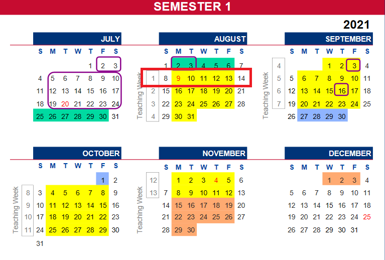

# NTUiCal
Python script to parse data from 'Check/Print Courses Registered' to ICS 

# Branch Structure
- main
- feature-fes -> flask experiments
- prod -> deployed to Heroku

# Input Data Required
 - Date of semester's first day according to [NTU Calendar](https://www.ntu.edu.sg/admissions/matriculation/academic-calendars)
 - Semester's table data from [Check/Print Courses Registered](https://sso.wis.ntu.edu.sg/webexe88/owa/sso_redirect.asp?t=1&app=https://wish.wis.ntu.edu.sg/pls/webexe/aus_stars_check.check_subject_web2)

# Usage
### 1. Using the deployed [site](ntuical-flask.herokuapp.com/)
- Select date of semester's first day
    <details>
    <summary>Example</summary>
    <br>
    *Monday of Week 1*
    
    
    </details>
- Paste table data from [Check/Print Courses Registered](https://sso.wis.ntu.edu.sg/webexe88/owa/sso_redirect.asp?t=1&app=https://wish.wis.ntu.edu.sg/pls/webexe/aus_stars_check.check_subject_web2)
    <details>
    <summary>Example</summary>
    <br>
    *Only copy the contents within the red box*
    
    
    </details>
- Click ```Parse```

### __OR__

### 2. Executing the [vibe.py](https://github.com/Reown/NTUiCal/blob/prod/fes/vibe.py) script locally
- Clone the repo
    ```
    $ git clone https://github.com/Reown/NTUiCal
    ```
- Create a ```.txt``` file that stores the table data from [Check/Print Courses Registered](https://sso.wis.ntu.edu.sg/webexe88/owa/sso_redirect.asp?t=1&app=https://wish.wis.ntu.edu.sg/pls/webexe/aus_stars_check.check_subject_web2)
- Install the required dependencies
    ```
    pip install -r requirements.txt
    ```
- Run script (2 arguements)
    ```
    python fes/vibe.py <txtFile> <DDMMYYYY>
    ```
- A ```.ics``` file will be saved in the same directory as your ```.txt``` file with the same name

# Supported Edge Cases
- [x] Exempted Modules
- [x] Online Modules
- [x] Recess Week
- [x] Saturday Classes
- [x] Merged rows (Empty Course/Title)
- [ ] Missing Laboratory Codes (Engineering only?)
- [ ] 'Asynchronous online learning' Remark
